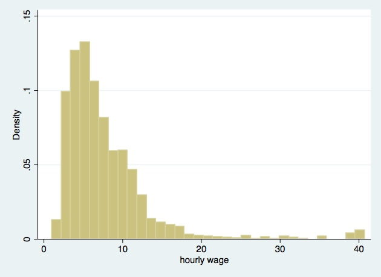
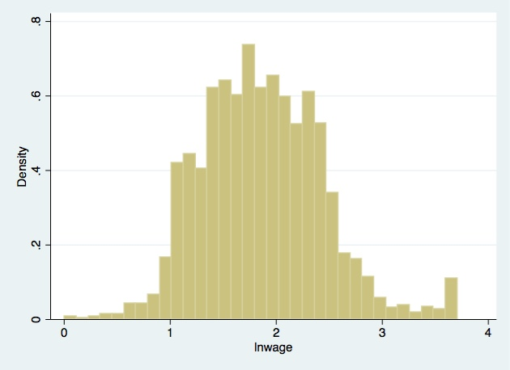

#### predicted lnwage = 0.659 + 0.084GRADE + 0.136LNTENURE - 0.151SOUTH
[Regression Output: log_transformation.txt](log_transformation.txt)

### skewed tenure

### logged tenure

### skewed wage

### logged wage

References:
[Princeton University Library	Data and Statistical 
Services - Log transformations interpretation](http://dss.princeton.edu/online_help/stats_packages/stata/log.html)
